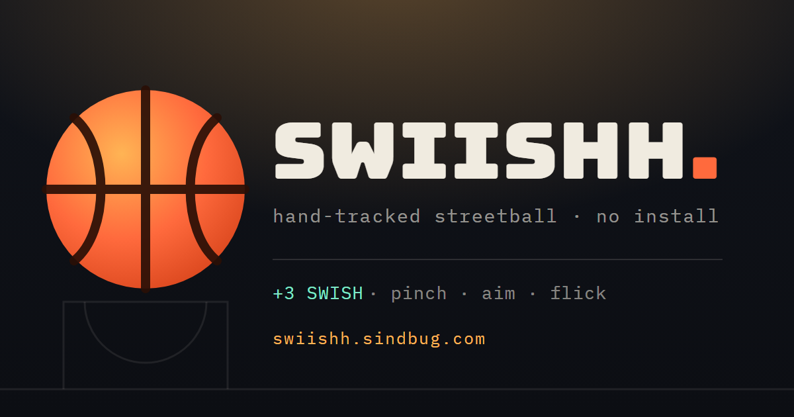

<div align="center">

# 🏀 SWIISHH

### Hand-tracked streetball you play with a flick of your wrist

Pinch and flick your hand in front of your webcam to shoot free throws on a midnight blacktop —
with a ball that flies on **real aerodynamics**: drag, Magnus lift from backspin, and spin-coupled bounces.

[**▶&nbsp; Play it live**](https://swiishh.sindbug.com/) &nbsp;·&nbsp; [Quick start](#quick-start) &nbsp;·&nbsp; [How it's played](#how-its-played-all-the-inputs) &nbsp;·&nbsp; [Physics](#physics)

[](https://swiishh.sindbug.com/)
[](LICENSE)
[](tsconfig.json)




</div>

---

Written in **strict TypeScript** with **zero runtime dependencies** and no binary build step. `tsc` compiles
`src/` → `dist/` for the browser (`yarn start` does it for you); tests and the dev server run their TypeScript
directly on Node ≥ 22.18 — **no bundler anywhere**.

```
pinch (or fist) ──▶ grab the ball
move your hand  ──▶ aim
flick up + open ──▶ shoot
```

No camera? No problem — there's a full **mouse & touch mode** (press the ball, drag, flick up).

## Contents

- [Quick start](#quick-start) · [Verify the physics](#verify-the-physics)
- [How it's played](#how-its-played-all-the-inputs)
- [Edge cases covered](#edge-cases-covered)
- [Physics](#physics)
- [Repo tour](#repo-tour)
- [Tuning cheatsheet](#tuning-cheatsheet)
- [Troubleshooting](#troubleshooting)
- [SEO, sharing & deployment](#seo-sharing--deployment)
- [License](#license)

---

## Quick start

Camera access requires a **secure context** (HTTPS or `localhost`), so open the folder through any static server rather than double-clicking `index.html`:

```sh
yarn install       # dev-only: typescript + @types/node
yarn start         # compiles src/ → dist/, then serves on port 3000 (zero-dep server in tools/serve.ts)

# or build once and use any static server:
yarn build
npx serve -l 3000 .
python -m http.server 3000
```

`yarn watch` keeps `tsc` recompiling on save while a server is running.

Then visit **http://localhost:3000**, click **Play with camera**, and allow camera access.

> **Playing from a phone:** the page must be served over HTTPS to use the camera (e.g. GitHub Pages, `netlify deploy`, or a tunnel like `npx localtunnel`). Prop the phone up, sit back ~arm's length, and play with the front camera. Mouse & touch mode works anywhere, no HTTPS needed.

### Verify the physics

```sh
yarn test         # = tsc (typecheck) + node tests/simulate.ts
```

Runs the exact shipped physics headlessly (Node executes the TypeScript directly via native type stripping): checks floor restitution against the NBA ball-inflation rule, sweeps flick strengths to prove a no-assist make window exists, and confirms aim assist can't rescue wild shots. Works as a CI gate.

---

## How it's played (all the inputs)

| | Camera mode | Mouse & touch mode |
|---|---|---|
| Grab | Pinch (thumb+index) **or** close your fist | Press on the ball |
| Aim | Move your hand — ball follows | Drag |
| Shoot | Flick upward and open your hand | Flick upward and release |
| Power | Flick speed | Flick speed |

**Scoring:** +3 swish (nothing but net), +2 off the rim/glass. Streaks, accuracy, and high score (persisted in `localStorage`) live on the LED scoreboard.

**Keyboard:** `P`/`Esc` pause · `M` mute · `R` new ball · `H` help.

**Camera extras:** switch front/back lens (📱), mirror toggle, live picture-in-picture with the tracked hand skeleton and a grab-strength meter.

**Aim assist** (menu toggle): hand tracking is noisy, so by default the launch's forward/lateral speed is partially blended toward the ballistic solution *for the arc you chose*. Your arc and flick are never faked — flat shots still die on the front iron, hard sideways flicks still miss. Turn it off for raw physics.

---

## Edge cases covered

- **No camera / permission denied / camera busy / no `getUserMedia`** → specific, human error message + one-tap fallback to pointer mode.
- **Insecure context** (opened over `http://` on a LAN) → camera button disabled with an explanation; pointer mode still works.
- **MediaPipe CDN unreachable** (offline) → graceful error, pointer mode unaffected.
- **GPU delegate unsupported** (older devices/iOS) → automatic retry on CPU.
- **Release detected late** (fast hands motion-blur; the pinch classifier lags the real release) → flick velocity is the *peak* over the recent history, not the velocity at the release event, so throws never read as fumbles.
- **Hand flicks out of the frame mid-throw** → counted as the throw it was; only a slow drift out of frame drops the ball (after a grace period, with a toast).
- **Tracking jitter** → grab/release thresholds have hysteresis; flick probes are 90 ms wide so single-frame noise can't spike the power.
- **Tab hidden** → auto-pause; the fixed-timestep loop clamps frame gaps so physics never explodes after a stall.
- **Ball stuck / rolled away** → auto-respawn on rest, out-of-bounds, or a 7 s shot timeout; `R` forces a new ball.
- **Weak release** → the ball just slips out of your hand (not counted as an attempt).
- **Autoplay policy** → all audio is synthesized and unlocked on first user gesture.
- **Private browsing / blocked storage** → stats degrade to session-only instead of crashing.
- **Resize / rotate / high-DPI** → projection and canvas rebuild on the fly (DPR capped at 2 for perf).
- **Reduced motion** preference → HUD animations are disabled.

---

## Physics

Everything is SI units on a regulation court, tuned in [`src/config.ts`](src/config.ts) and validated by [`tests/simulate.ts`](tests/simulate.ts).

| Quantity | Value | Source |
|---|---|---|
| Rim height / Ø | 3.048 m / 0.457 m | FIBA/NBA |
| Free-throw distance | 4.191 m to rim center | FIBA/NBA |
| Backboard | 1.829 × 1.067 m, face 4.572 m from FT line | FIBA/NBA |
| Ball | r = 0.121 m, m = 0.624 kg (size 7) | FIBA |
| Drag | quadratic, C_d = 0.47, ρ = 1.225 kg/m³ | sphere |
| Magnus lift | C_l = min(0.45, 1/(2 + v/rω)) | empirical fit |
| Floor bounce | e = 0.86 → 6 ft drop rebounds ~49 in | NBA inflation rule |
| Inertia | hollow sphere, I = ⅔mr² | ball is a shell |

**Integration:** semi-implicit Euler at a fixed **240 Hz** (decoupled from the render rate via an accumulator). At peak launch speed the ball moves ~5 cm per step against a 14 cm rim-contact envelope, so the rim torus can't tunnel; the thin backboard plane additionally checks the previous-position crossing.

**Collisions** ([`src/physics/colliders.ts`](src/physics/colliders.ts)): impulse-based with restitution + Coulomb friction that **couples velocity and spin** through the hollow-sphere inertia — backspin checks up off the floor, grabs the rim, and climbs the glass, like a real ball. The rim is an exact torus test (closest point on the rim circle vs. sphere).

**Net** ([`src/physics/net.ts`](src/physics/net.ts)): 10 verlet strands × 5 rings with stretch-only rope constraints in a diamond mesh. The ball pushes the cords; a drag cone below the rim stands in for the cords slowing the ball (one-way coupling = unconditionally stable).

**The throw** ([`src/game/throwModel.ts`](src/game/throwModel.ts), [`src/game/flickMeter.ts`](src/game/flickMeter.ts)): your flick is measured in the hold plane in m/s — as the peak 90 ms window ending near the release, which compensates for the tracker reporting "hand opened" tens of milliseconds late. Upward flick sets arc *and* adds forward power and backspin; sideways flick aims and adds sidespin (which genuinely curves the flight). A regulation free throw needs ~7 m/s at ~52° — the make window in the simulation sits exactly there.

**Scoring detection:** the ball center must cross the rim plane downward inside the ring (interpolated between substeps); swish = no rim/board contact during the live shot.

---

## Repo tour

```
index.html              shell + HUD markup (menus, scoreboard, help)
styles/main.css         all styling — "midnight blacktop" theme tokens at the top
src/                    strict TypeScript, compiled to dist/ for the browser
  config.ts             ⚙ every tunable constant, documented with units
  main.ts               composition root: wiring, mode flows, shortcuts
  core/                 math (vec3), typed event emitter, fixed-timestep loop
  physics/              ball, colliders, net, world  ← DOM-free, Node-importable
  game/                 game state machine, throw model, stats, HUD bridge
  input/                handInput (MediaPipe), pointerInput (mouse/touch)
  render/               pinhole camera, court art, ball/effects, renderer
  audio/                WebAudio-synthesized SFX (no sound files)
tests/simulate.ts       headless physics validation (npm test)
tools/serve.ts          zero-dep static dev server (npm start)
tools/build.ts          assembles the deployable site into public/ (npm run build)
tools/make-assets.ts    rasterises favicons / PWA icons / OG card (npm run assets)
tsconfig.json           typecheck config (src + tests + tools, noEmit)
tsconfig.build.json     browser build: src/ → dist/ as plain ES modules

robots.txt · sitemap.xml · site.webmanifest · browserconfig.xml · humans.txt
.well-known/security.txt · 404.html · CNAME      crawler / install / discovery
favicon.* · *-icon*.png · icon-*.png · og-image.png   generated share & app icons
```

Design rules the codebase follows:

- **Physics is DOM-free** so it runs in Node — that's what makes `npm test` honest.
- **Modules talk through a tiny typed event emitter**; input devices and the game know nothing about each other's internals. Adding a new controller (gamepad? keyboard-aim?) means emitting `down/move/up`-style events and ~20 lines in `main.ts`.
- **Every magic number lives in `config.ts`** with units and rationale.
- **No allocations in hot loops** — vec3 scratch registers are reused.
- **TypeScript stays erasable** (`erasableSyntaxOnly`): no enums, namespaces or parameter properties, so Node can strip the types and run `tests/` and `tools/` directly — what ships to the browser and what runs in CI is the same code, not two toolchains.
- The only runtime dependency, `@mediapipe/tasks-vision`, is version-pinned and loaded from CDN *only when camera mode is chosen*.

## Tuning cheatsheet

| I want to… | Touch this |
|---|---|
| Make shots easier/harder | `ASSIST.CAMERA` / `ASSIST.POINTER`, `THROW.FWD_FROM_FLICK` |
| Change throw feel | `THROW.*`, `HOLD.SMOOTHING`, `HOLD.VELOCITY_WINDOW_MS` |
| Bouncier/deader surfaces | `SURFACES.*` |
| Stickier/looser grab gesture | `GESTURE.PINCH_*`, `GESTURE.FIST_*` |
| Throws dropping / phantom throws | `THROW.MIN_UP_FLICK`, `HOLD.FLICK_RECENCY_MS` |
| Move the camera/view | `RENDER.CAM_POS`, `RENDER.HORIZON` |
| Debug overlay (FPS, ball state) | append `?debug` to the URL |

After touching physics or `THROW.*`, run `yarn test` — the sweep printout shows exactly how the make window moved.

## Troubleshooting

- **"Camera needs HTTPS or localhost"** — serve the folder (`yarn start`); don't open `index.html` directly, and don't use a bare LAN IP over http.
- **Blank page / 404 on `dist/main.js`** — the browser bundle hasn't been compiled; run `yarn start` (or `yarn build`) once.
- **Hand not detected** — more light, palm toward the lens, hand fully in frame, ~50–80 cm away. The PiP label tells you what the tracker sees.
- **Ball releases while aiming** — exaggerate the pinch; the grab meter at the bottom of the PiP shows how solidly you're holding.
- **Ball drops instead of throwing** — flick and open your hand in one motion (don't stop, then open). It's fine to flick right out of the frame — that still counts as a throw.
- **Choppy on an old laptop** — close other tabs using the camera/GPU; tracking is the heavy part, the game itself is cheap. The GPU→CPU fallback is automatic.
- **Shots feel impossible** — that's regulation physics 🙂 keep aim assist on, and aim for a high arc (~52°).

## SEO, sharing & deployment

The site ships a complete discovery layer so it indexes well and unfurls into a
rich card anywhere it's pasted. Canonical origin: **https://swiishh.sindbug.com/**.

**In `index.html` `<head>`:**
- Search basics — keyword-led `<title>`/`description`, `canonical`, `robots`/`googlebot` (with `max-image-preview:large`), `author`, `color-scheme`, theme color.
- **Open Graph** + **Twitter `summary_large_image`** — title, description, URL, locale, and a 1200×630 PNG with explicit dimensions and alt text, so Facebook / LinkedIn / Slack / Discord / iMessage / X all render the card.
- Apple / Android / Windows install meta + `<link rel="manifest">`, icon set, and `mask-icon`.
- **Schema.org JSON-LD** (`@graph`): `VideoGame` (free offer, platform, single-player, MIT), `WebSite`, `Person`, and a `FAQPage` (play / install / camera / privacy / scoring).
- A `<noscript>` description so the page says something useful without JS.

**Root files:** `robots.txt` (+ `Sitemap:`), `sitemap.xml` (with image), `site.webmanifest` (installable PWA — name, icons incl. maskable, screenshot, categories), `browserconfig.xml`, `humans.txt`, `.well-known/security.txt` (RFC 9116), a themed `404.html`, and `CNAME` for the custom domain.

### Regenerating the icons & social card

```sh
yarn assets        # SVG masters in tools/make-assets.ts → favicon/PWA/OG PNGs
```

The brand mark and OG card are defined as **SVG in `tools/make-assets.ts`** (the
source of truth) and rasterised by a headless Chromium already on the machine —
**zero new dependencies**. The resulting PNGs/ICO are committed (the static host
can't rasterise SVG at deploy time); rerun the command whenever the mark changes.

### Build & deploy

```sh
yarn build         # tsc → dist/, then tools/build.ts assembles everything into public/
```

`public/` is the deploy root (Vercel's default; works on any static host). It
contains `index.html`, `styles/`, `dist/`, and every SEO/icon file above, so each
resolves at the site root (`/robots.txt`, `/og-image.png`, …). `npm start` serves
the repo root locally with the correct content types and the same `404.html`.

> **Changing the domain?** Update the absolute URLs in `index.html` (`canonical`,
> `og:*`, `twitter:*`, JSON-LD), `robots.txt`, `sitemap.xml`, `site.webmanifest`,
> `.well-known/security.txt`, `CNAME`, and `package.json`'s `homepage`, then
> `yarn assets` to refresh the URL printed on the card.

## License

[MIT](LICENSE) © Rayhan

---

<p align="center">Bugged by <a href="https://sindbug.com"></a></p>
